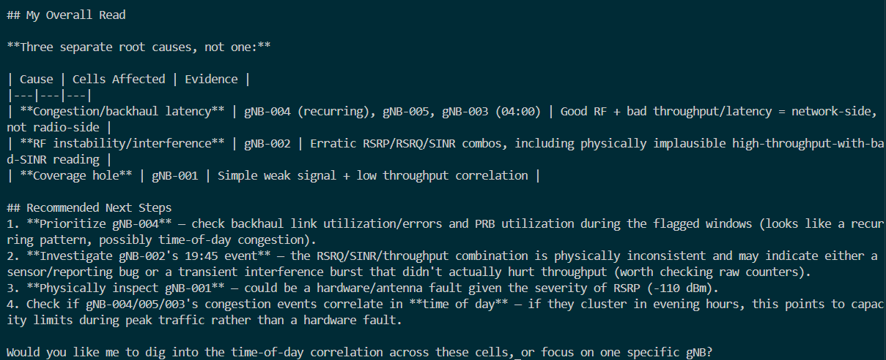
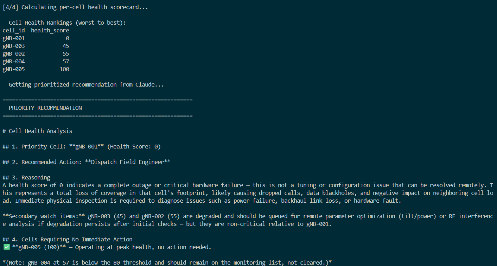

# 5G Network Anomaly Detection Agent

An intelligent, end-to-end network operations center (NOC) AI assistant that automatically processes 5G network KPI telemetry, performs statistical anomaly detection using Z-scores, and uses Claude 3.5 Sonnet to generate structured, actionable root-cause diagnostics and resource prioritization.

## Key Features
- **Synthetic 5G Data Generation:** Simulates realistic gNodeB performance metrics (RSRP, RSRQ, SINR, Throughput, Latency) with injected anomalies.
- **Statistical Outlier Detection:** Implements a Z-score anomaly detector aligned with 3GPP thresholds to catch KPI deviations.
- **AI-Powered Diagnostics:** Connects to Claude's API with an engineered system persona to perform domain-specific diagnostic triage.
- **Per-Cell Health Scorecard:** Aggregates multi-KPI faults into a prioritized health rankings table to optimize engineering dispatch.

## Project Architecture & Results

### 1. Statistical KPI Anomaly Detection
The agent scans real-time streams and flags metrics deviating by more than 2.0 standard deviations from the mean.

### 2. AI Root-Cause Diagnostic Report
Instead of raw numbers, Claude interprets the statistical failures into structured NOC tickets complete with severity rankings and field actions.



### 3. Prioritized Cell Health Scorecard
In the project extension (Secret Mission), the agent aggregates telemetry to rank network towers from worst to best, enabling optimal resource dispatch.



## Getting Started

### Prerequisites
- Python 3.10+
- Anthropic API Key

### Installation & Execution
1. Clone the repository and navigate inside:
   ```bash
   git clone https://github.com/your-username/5g-anomaly-agent.git
   cd 5g-anomaly-agent
   ```
2. Create and activate a virtual environment:
   ```bash
   python -m venv .venv
   # Windows (CMD)
   .venv\Scripts\activate
   # Windows (PowerShell)
   $env:ANTHROPIC_API_KEY="your_key"
   ```
3. Install dependencies:
   ```bash
   pip install anthropic pandas
   ```
4. Set your API Key and run the agent:
   ```bash
   python network_agent.py
   ```